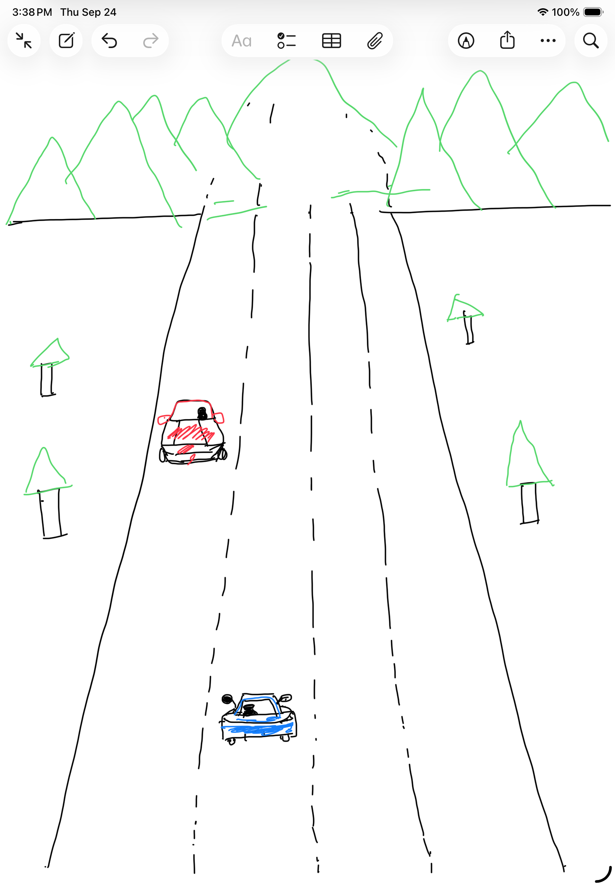
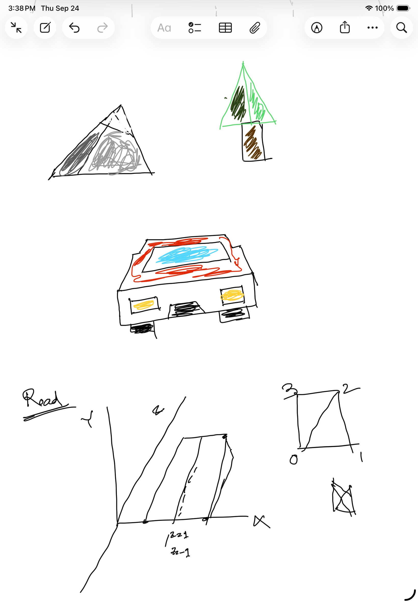
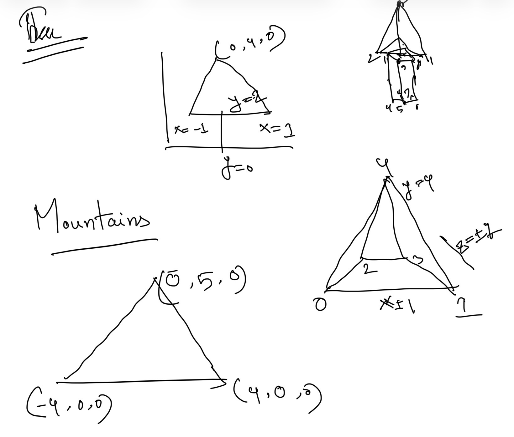
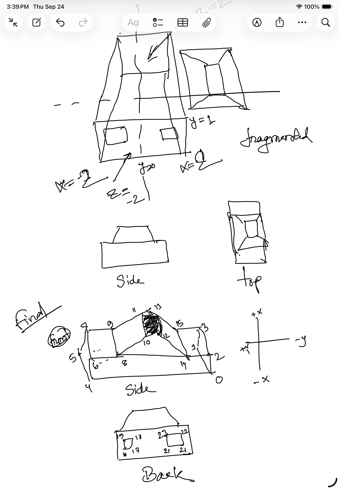
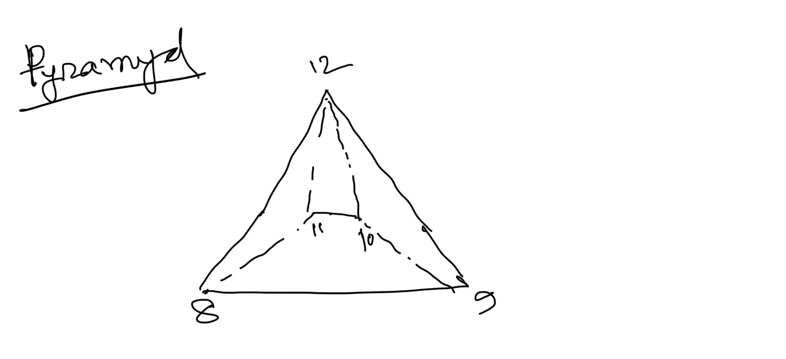
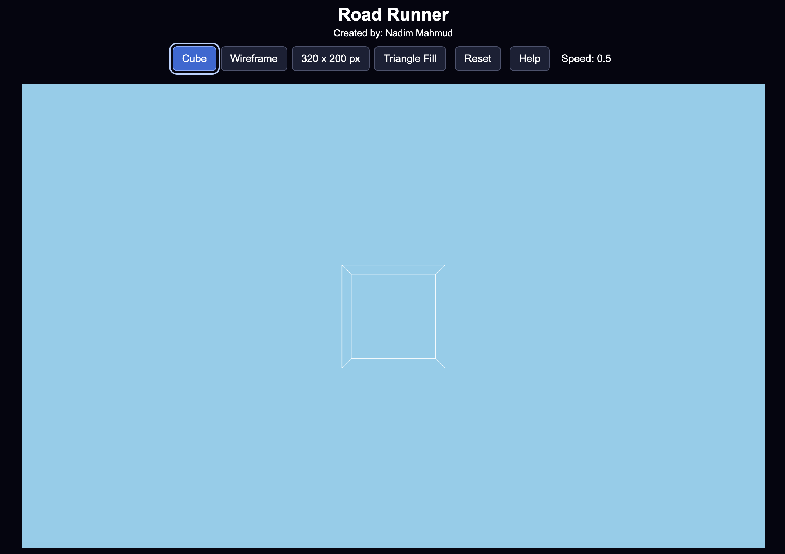
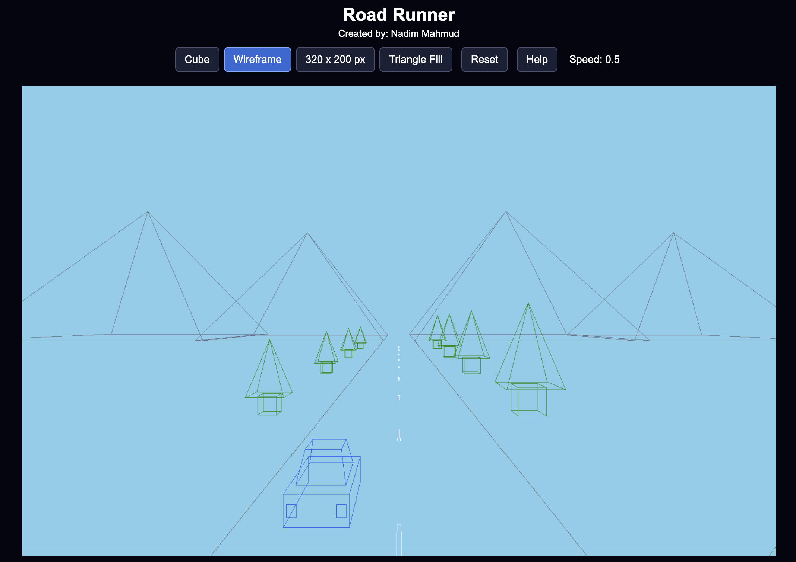
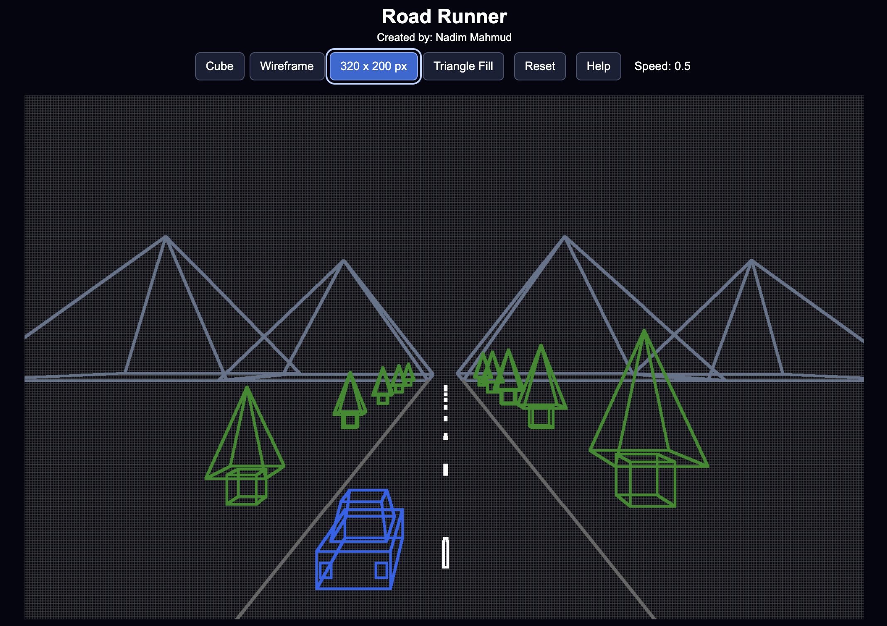
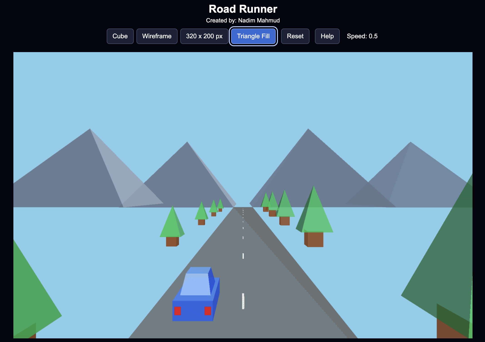

# Project #1 Road Runner

<a href="https://nadim-mahmud.github.io/ComputerGraphics/road-runner/" target="_blank" rel="noopener noreferrer">
  Try This Project
</a>

### Overview

Road Runner is an interactive, browser-based 3D driving simulation developed using HTML, CSS, JavaScript, and the HTML Canvas 2D API. The primary objective of this project is to implement fundamental computer graphics algorithms from scratch and demonstrate how three-dimensional objects can be represented, projected, rendered, and animated on a two-dimensional screen, with pinhole camera projection.

The application features a driving environment consisting of a car, road, lane markings, roadside trees, and mountains. Users can interact with the environment by controlling the car, adjusting the camera position, and switching between different rendering modes.

The project was designed around four progressive stages: constructing a basic 3D cube, creating a wireframe driving environment, and implementing triangle rasterization to produce filled 3D objects.

### Project Walk Through

YouTube: https://youtu.be/VwA_JdScraM

  

### Design plans

The idea for this project was inspired by the numerous car racing games I have played throughout my life. I wanted to create something similar, applying the computer graphics concepts I learned in this course. I began by drawing a basic scene with different types of objects. Next, I experimented with representing these objects in 3D. Finally, I sketched wireframe models and defined the coordinates needed to construct the basic objects in the scene. I have attached my initial design sketches to this documentation to illustrate how the project evolved from a simple concept into a 3D environment.

  

  

  

  

  

  

### Project Details

#### Features and Controls:

The top navigation bar allows users to visualize different stages of the project's development. Using the navigation buttons, users can switch between four rendering modes: Cube, Wireframe, Low-Resolution Display Simulation, and Triangle-Filled Object Simulation. These modes demonstrate how the scene evolves from basic geometric shapes into a more complete 3D environment. I have also included a Reset button to restore the application to its initial state and a Help button that provides a user guide explaining the available controls.

Navigation Controll

| Mode              | Description                                                    |
| ----------------- | -------------------------------------------------------------- |
| **Cube**          | Displays the foundational 3D cube and allows camera movement.  |
| **Wireframe**     | Displays the animated driving environment as connected lines.  |
| **320 × 200 px**  | Renders the scene through a low-resolution display simulation. |
| **Triangle Fill** | Renders the scene as filled, colored triangles.                |

Additional controls:

- **Reset** restores the active scene to its initial state.
- **Help** opens an in-application guide to the available controls.
- **A / D** moves the car left and right along the X-axis to change lanes.
- **W / S** increases and decreases the car's speed.
- **Arrow keys** move the camera forward, backward, left, and right.

The camera position can be adjusted using the keyboard's arrow keys. This allows users to explore the 3D scene from different viewing positions and perspectives. The camera's movement along the Z-axis is restricted to a predefined range to prevent it from moving beyond the intended viewing boundaries.

### Feature examples

The following examples correspond to the project's four rendering stages. Open
the live page to interact with each view:

#### Cube

The landing view with the cube selected; arrow keys adjust the camera location.

  

#### Wireframe scene

The tree and road divider move to create a driving effect; A/D and W/S control
the car, while the arrow keys control the camera.

  

#### 320 × 200 display

The wireframe scene visualized through a 320 × 200 pixel mock display.

  

#### Triangle-filled scene

The same animated scene rendered with colored triangles.

  

> **Interactive preview:** [Open Road Runner](https://nadim-mahmud.github.io/ComputerGraphics/road-runner/)

### Implementation details

#### Model generation

Simply drew those models on paper, then assumed their coordinates at the origin of coordinates. Connected those estimated vertices by defining edges.

#### Perspective projection

I used perspective projection to convert 3D coordinates into 2D screen positions. Each vertex is first adjusted relative to the camera position and then projected using `u = (x/z’) * f + W/2 and v = H/2 - (y’/z’) * f`, where f is the focal-length scaling factor and W and H are the screen dimensions. This makes nearby objects appear larger and distant objects smaller. Vertices behind or too close to the camera are excluded from rendering.

#### Line drawing and wireframe rendering

After projecting vertices onto the screen, the application connects the corresponding endpoints using a custom line-drawing algorithm. The algorithm calculates the horizontal and vertical distances between two projected points and determines the number of drawing steps using the larger absolute difference. It then increments the horizontal and vertical coordinates at each step and draws a pixel using the Canvas API, which we learned in class. The same algorithm is reused to draw the cube, car, road boundaries, trees, mountains, and lane markings.

#### Triangle drawing and rasterization

To render solid objects, the application defines surfaces as collections of triangles. Each triangle contains three vertex indices and an associated color. After transforming and projecting its vertices, the renderer calculates the triangle's screen-space bounding box. For each candidate pixel within that box, edge functions determine whether the pixel lies inside the triangle. Pixels satisfying the inside-triangle test are filled with the triangle's assigned color.

### Future work

Although the application demonstrates the fundamental stages of a 3D graphics pipeline, several improvements could extend its functionality and visual quality.

One potential improvement is implementing a depth buffer to correctly handle overlapping surfaces. Currently, triangles are rendered according to their drawing order rather than performing a per-pixel depth comparison.

Another improvement would be implementing proper clipping for lines and triangles that intersect the camera's near plane. This would allow partially visible objects to be rendered instead of discarding primitives when a vertex is too close to the camera.

Future versions could also introduce more advanced driving mechanics, including curved roads, collision detection, acceleration, braking, and steering animations. Additional visual improvements could include lighting, surface shading, textures, and more complex environmental objects.

There is a lot of scope for coding improvement to make this system more maintainable; the current coding is messy.

Triangle rendering becomes very slow; there might be a way to fix the rendering speed. We need to figure that out.

The original idea was to create a car collision avoidance game, but we could not complete it due to the time constraints.

#### AI Disclosure:

I used AI for brainstorming (e.g., how to convert a static scene with an animation effect) and getting help with CSS design, sometimes bug finding. Used for readme generation for this project documentation, as that was not part of this project's requirements, so didn’t spend much time on that.
